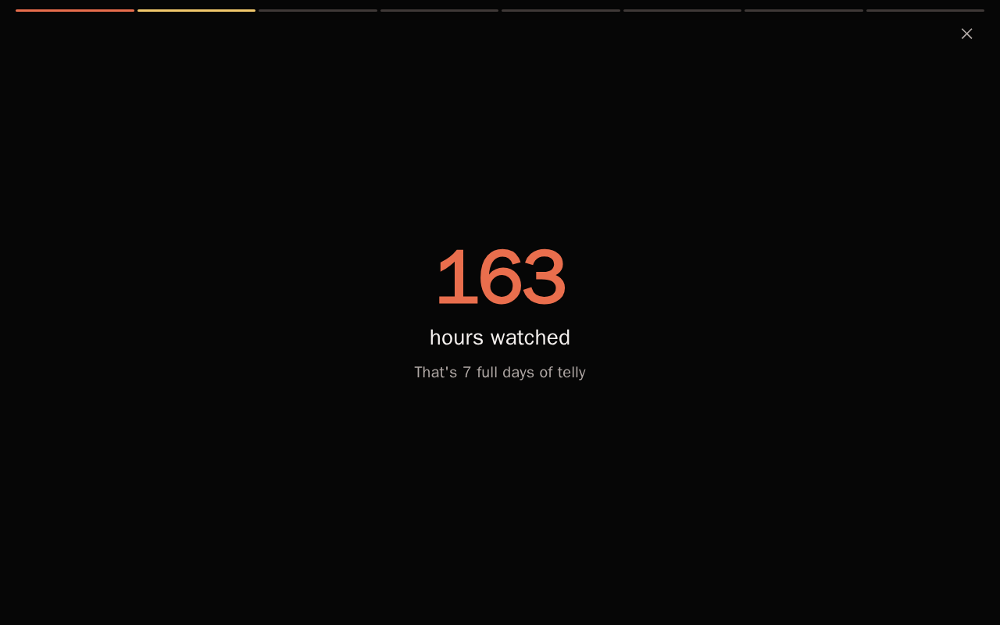

# Homelab Wrapped

Your homelab already knows what you watched, photographed, and collected this year. Homelab Wrapped turns that into a beautiful, swipeable year-in-review — like the streaming services make, except it runs on your own hardware, reads your own services, and never sends a byte anywhere. Yearly recaps, monthly recaps, and a daily "On This Day" page.



- **Privacy-first, provable.** Zero outbound network calls — enforced by a test fixture that fails the suite if any code opens an unexpected socket. Optional extras like email use *your* SMTP server.
- **Read-only.** Connectors use the least-privileged access each service supports. Nothing is ever written to your services.
- **Lean.** Five runtime dependencies, no build step, idles near zero. Happy on a Raspberry Pi.
- **Share on your terms.** Export cards as PNG rendered client-side in your browser; facts marked private are visibly excluded from exports.

## Quick start

```bash
mkdir wrapped && cd wrapped && mkdir data
curl -LO https://raw.githubusercontent.com/smbdev/homelab-wrapped/main/docker-compose.yml
curl -L -o data/config.yaml https://raw.githubusercontent.com/smbdev/homelab-wrapped/main/config.example.yaml
# edit data/config.yaml — point it at your services
docker compose up -d

docker compose exec wrapped wrapped sync    # pull events from your services
docker compose exec wrapped wrapped build   # build this year's story
```

Open <http://localhost:8000> and press play on your year.

## Installation

**Prerequisites:** Docker, or Python ≥ 3.13.

### Docker (recommended)

See the quick start above. One container, one `/data` volume (config, cache, stories). With `schedule:` enabled in config, the same container also builds monthly recaps and On This Day pages automatically.

### pip

```bash
pip install git+https://github.com/smbdev/homelab-wrapped
wrapped --config config.yaml sync && wrapped build && wrapped serve
```

### From source

```bash
git clone https://github.com/smbdev/homelab-wrapped && cd homelab-wrapped
uv sync
uv run wrapped sync && uv run wrapped build && uv run wrapped serve
```

## Configuration

One file: `config.yaml` — see [config.example.yaml](config.example.yaml) for every option with comments. The short version:

```yaml
timezone: Europe/London
connectors:
  jellyfin:
    type: jellyfin
    db_path: /jellyfin-config/data/playback_reporting.db
  immich:
    type: immich
    url: http://immich.local:2283
    api_key: YOUR_KEY
schedule:            # optional always-on mode
  monthly_recap: true
  on_this_day: true
# email: ...         # optional digests via your own SMTP
```

Commands: `wrapped sync` (collect events) · `wrapped build [--year N | --month YYYY-MM | --on-this-day [MM-DD]]` · `wrapped serve` · `wrapped schedule` · `wrapped purge` (wipe the local cache).

## Connectors

| Service | How it reads | Events |
|---|---|---|
| **Jellyfin** | Playback Reporting plugin's SQLite, opened read-only | plays, watch time, top shows |
| **Immich** | metadata API with an API key | photos, busiest day |
| **Generic CSV/JSON** | any local file you export | anything you like |

Your service missing? Export it to CSV and use the generic connector today — or add a real one: a connector is one Python file with three methods, and the [connector guide](docs/connector-guide.md) walks you through it with a worked example. This is the best way to contribute.

## Contributing

Issues and PRs welcome — see [CONTRIBUTING.md](CONTRIBUTING.md) for dev setup and conventions, and the [connector guide](docs/connector-guide.md) for the highest-impact contribution.

## License

[AGPL-3.0](LICENSE) — if you host a derivative for others, it stays open.
