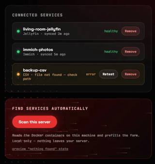

<h1 align="center">Homelab Wrapped</h1>

<p align="center"><b>Your homelab's year in review — beautiful, swipeable, and it never leaves your server.</b></p>

<p align="center">
  <a href="https://github.com/smbdev/homelab-wrapped/actions/workflows/ci.yml"></a>
  <a href="https://github.com/smbdev/homelab-wrapped/releases"></a>
  <a href="https://github.com/smbdev/homelab-wrapped/pkgs/container/homelab-wrapped"></a>
  <a href="LICENSE"></a>
</p>

Your homelab already knows what you watched, photographed, and collected this year. Homelab Wrapped turns that into a beautiful, swipeable year-in-review — like the streaming services make, except it runs on your own hardware, reads your own services, and never sends a byte anywhere. Yearly recaps, monthly recaps, and a daily "On This Day" page.


- **Privacy-first, provable.** Zero outbound network calls — enforced by a test fixture that fails the suite if any code opens an unexpected socket. Optional extras like email use *your* SMTP server.
- **Read-only.** Connectors use the least-privileged access each service supports. Nothing is ever written to your services.
- **Lean.** Five runtime dependencies, no build step, idles near zero. Happy on a Raspberry Pi.
- **Share on your terms.** Export cards as PNG rendered client-side in your browser; facts marked private are visibly excluded from exports.

## Quick start

One command:

```bash
docker run -d --name homelab-wrapped -p 8365:8365 -v wrapped-data:/data --restart unless-stopped ghcr.io/smbdev/homelab-wrapped
```

Open <http://localhost:8365> — the first visit asks you to create an admin account (stored as a scrypt hash in `auth.json` on your volume; nothing leaves the box). Then **Settings** → **Scan this server** finds services running in Docker and adds them in one click (or add them manually — every add tests the connection first). Your first recap syncs and builds itself — no config files, no restarts.

A few optional extras, depending on your setup:

- **Let it find your services.** The scan reads the Docker socket — add `-v /var/run/docker.sock:/var/run/docker.sock:ro` to the command above (the compose file includes it by default). Read-only and local-only; drop the mount if you'd rather add services manually.
- **File-reading connectors** — Jellyfin's database, Pi-hole's query log, CSV exports — need that file mounted in: e.g. `-v /path/to/jellyfin/data:/jellyfin-data:ro`. Pure-API connectors like Immich need nothing extra.
- **Port taken?** Change the host side: `-p 9090:8365`.
- **Behind Authelia/Authentik** or another reverse proxy that sets `X-Auth-User`? Put `auth: proxy` in `config.yaml` and the sign-in page steps aside.

## Installation

**Prerequisites:** Docker, or Python ≥ 3.13.

### Docker (recommended)

The quick start above is all of it: one container, one `/data` volume (config, cache, stories). Prefer compose? [docker-compose.yml](docker-compose.yml) is the same thing with room for connector mounts. With `schedule:` enabled (in Settings-managed `config.yaml`), the running container also builds monthly recaps and On This Day pages automatically.

### Portainer, Dockge, Komodo & friends

Prebuilt multi-arch images (amd64 + arm64) are on GHCR: `ghcr.io/smbdev/homelab-wrapped`. Paste this stack into your manager's web editor (Portainer: **Stacks → Add stack**):

```yaml
services:
  wrapped:
    image: ghcr.io/smbdev/homelab-wrapped:latest
    ports:
      - "8365:8365"
    volumes:
      - /opt/wrapped/data:/data   # host path holding config.yaml
      - /var/run/docker.sock:/var/run/docker.sock:ro   # for the Settings scan; remove to opt out
    restart: unless-stopped
```

Deploy, open port 8365, and add your services on the **Settings** page — same zero-config flow as the quick start. Add read-only mounts to the stack for file-reading connectors (e.g. `- /path/to/jellyfin/data:/jellyfin-data:ro`).

### pip

```bash
pip install git+https://github.com/smbdev/homelab-wrapped
wrapped sync && wrapped build && wrapped serve
```

### From source

```bash
git clone https://github.com/smbdev/homelab-wrapped && cd homelab-wrapped
uv sync
uv run wrapped sync && uv run wrapped build && uv run wrapped serve
```

## Configuration



Connectors are managed from the **Settings** page in the app. Under the hood everything lives in one file, `config.yaml` — edit it directly for the options without UI yet (timezone, scheduling, email digests); see [config.example.yaml](config.example.yaml) for every option with comments. The short version:

```yaml
timezone: Europe/London
connectors:
  jellyfin:
    type: jellyfin
    db_path: /jellyfin-data/data/playback_reporting.db
  immich:
    type: immich
    url: http://immich.local:2283
    api_key: YOUR_KEY
schedule:            # optional always-on mode
  monthly_recap: true
  on_this_day: true
# email: ...         # optional digests via your own SMTP
```

Commands: `wrapped sync` (collect events) · `wrapped build [--year N | --month YYYY-MM | --on-this-day [MM-DD]]` · `wrapped serve` · `wrapped schedule` · `wrapped purge` (wipe the local cache).

How it works: `sync` reads each service into a local SQLite event cache, `build` turns those events into a story JSON, and `serve` plays it — every step on your machine.

## Connectors

| Service | How it reads | Events |
|---|---|---|
| **Jellyfin** | Playback Reporting plugin's SQLite, opened read-only | plays, watch time, top shows |
| **Immich** | metadata API with an API key | photos, busiest day |
| **Pi-hole** | FTL query database, opened read-only | ads blocked, most-blocked domains |
| **Paperless-ngx** | documents API with a token | documents archived, top senders |
| **This server (Docker)** | the read-only Docker socket, no credentials | TB moved per container, container count |
| **Generic CSV/JSON** | any local file you export | anything you like |

Your service missing? Export it to CSV and use the generic connector today — or add a real one: a connector is one Python file with three methods, and the [connector guide](docs/connector-guide.md) walks you through it with a worked example. This is the best way to contribute.

## Contributing

Issues and PRs welcome — see [CONTRIBUTING.md](CONTRIBUTING.md) for dev setup and conventions, and the [connector guide](docs/connector-guide.md) for the highest-impact contribution.

## License

[AGPL-3.0](LICENSE) — if you host a derivative for others, it stays open.
